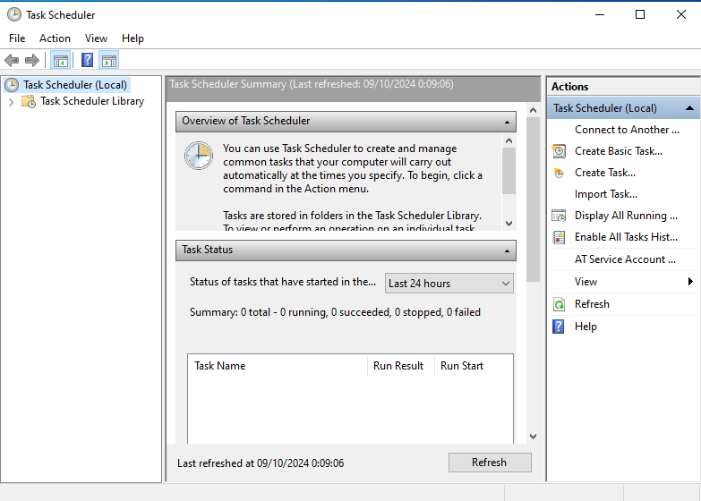
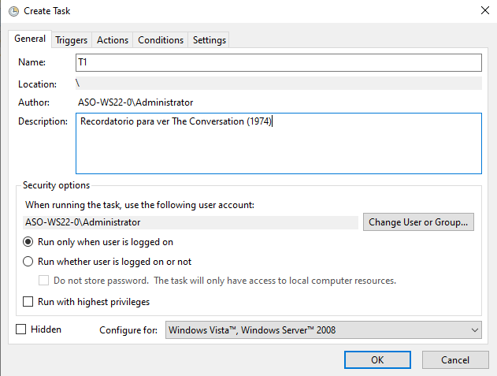
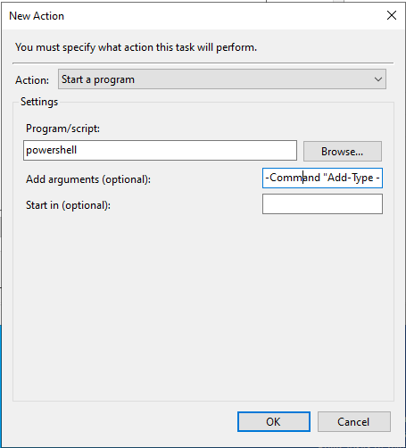

# ASO:Actividade 1.1
## Instalar Windows Server 2022 nunha VM de VirtualBox. 

1. Crear unha nova máquina en virtualBox.

2. Nomear a máquina e engadir a ISO almacenada no noso host.

3. Configurar as características de hardware da máquina, neste caso imos establecer os seguintes parámetros:
- 4GB de RAM
- 2 CPUs 
- 50GB de memoria.  

  

Estes parámetros poden ser modificados unha vez teñamos a máquina instalada, polo que é posible aumentalos o disminuilos segundo vaiamos precisando.
É importante revisar ou polo menos localizar onde modificar a orde de arranque xa que unha vez teñamos o sistema opertaivo instalado é unha boa 
práctica desconectar opcións de arranque.

4. Arrancamos a máquina virtual.  
  
5. Instalamos Windows Server 2022 seguindo o instalador.
- Seleccionamos o idioma de instalación.  
  
- Seleccionamos a versión a instalar.  
  
- Seleccionamos o tipo de instalación.  
  
- O primeiro que vemos ao iniciar windows server e o Server Manager.
  

## Eliminar requerimento CTRL+ALT+DEL ao inicio de sesión.
Para facilitar o acceso aos usuarios da máquina virtual é unha boa práctica eliminar a necesidade de presionar a secuencia CTRL+ALT+DEL ao inicio de sesión.
Isto facemolo da seguinte forma:
- Accedemos ao editor de politicas de grupo locais **"Local Group Policy Editor"**  
- Accedemos a ruta: Windows Settings>Security Settings>Local Policies>Security Options  
  

- Deshabilitamos a política: Interactive logon: Do not require CTRL+ALT+DEL  

- Boas prácticas: Realizar un gpupdate no cmd de windows para que actualice as politicas do servidor, en caso de políticas de dominio é imprescindibole.
## Modificar directivas de contrasinais: establecendo unha vixnecia mínima de 15 días e máxima de 60.
Imos modificar as directivas de contrasinais de windows establecendo os seguintes parámetros:  
- Vixencia mínima: 15 días
- Vixencia máxima: 60 días  
Isto realizamolo dende o xestor de politicas de seguridade locais **Local Security Policy**:
- Seguimos a ruta: Account Policies>Password Policy  
  

- Configuramos a política **"Minimum password age Properties"**
  

- Configuramos a política **"Maximum password age Properties"**
  

## Engadir usuarios locais ao sistema
Vamos a engadir tres usuarias ao sistema: Larisa Shepitko, Bibi Andersson e Monica Vitti.  

Ainda que é posible facelo dende a interfaz gŕafica é moito máis sinxelo realizalo dende o cmd de windows.
Co comando net user engadimos as usuarias no campo que correspondería ao contrasinal poñemos un "*" para que requira engadir o contrasinal de forma privada.
Unha vez rematamos de engadir as usuarias comprobamos co comando *net user* que esten correctamente engadidas  
  

Comprobamos que todas as usuarias poden iniciar sesión na máquina local

## Engadir e xestionar grupos locais
Para engadir grupos locais imos facelo co comando *net localgroup*. Imos engadir dous grupos aos que imos engadir usuarios:
|Grupo | Usuarias |
|--------- | --------- |
|directoras |Larisa Shepitko |
| actrices | Bibi Andersson |
| actrices | Monica Vitti |

Primero creamos os grupos  
  
Agora engadimos as usuarias aos grupos  
  

## Engadir a característica Copias de Seguridade de Windows Server
Copias de seguridade de Windows Server é unha ferramenta para protexer os datos almacenados no servidor mediante a creación de copias dos archivos, volúmenes ou aplicacións. Para poder utilizar esta característica en Windows Server debemos engadila dende o Server Manager:
- Accedemos ao server manager e seleccionamos **"Add roles and features"**  
    
- Seguimos o instalador até chegar a **features** onde seleccionamos **Windows Server Backup**
    
- Deixamos instalar e comprobamos como xa podemos acceder a ferramenta para realizar backups dende a barra de tarefas de windows
    

## Establer cuotas de disco 
As cuotas de disco son unha ferramenta moi útil para limitar o uso dos recursos aos usuarios e así ter un control total sobre os propios recursos. Neste caso imos establecer unhas cuotas de disco para os cartafoles persoais das usuarias:  

| Usuaria | Cuota |
| ------- | ----- |
| Bibi Anderson | 100 Mb |
| Monica Vitti | 100 Mb |
| Larissa Shepitko | 200 Mb |  

Para establecer as cuotas de disco seguimos os seguintesd pasos:

- Accedemos as propiedades do disco local C:  
  
- Habilitamos o xestor de cuotas de disco e accedemos a él
    
- Xeramos unha nova entrada de cuota  
  
- Seleccionamos os usuarios aos que imos aplicar a cuota  
    
- Seleccionamos o valor de cuota que queremos para os usuarios seleccionados  
    
- Comprobamos como se listan as novas entradas de cuota xeradas
  

## Asignar permisos a cartafois
A hora de compartir recursos é importante limitar o acceso de estos segmentando por usuarios, para iso establecemos nos respectivos cartafoles permisos especificos para cada usuario. Neste caso imos asignar os permisos a tres novos cartafois creados para cada usuaria   

| Usuaria | Cartafol | Permisos |
| ------- | ----- | ---------|
| Bibi Anderson | persona-1966 | Lectura e Execución |
| Monica Vitti |  l'avventura-1960 | Lectura |
| Larissa Shepitko | the-ascent-1977 | Control total |

### Engadir permisos de control total
- Selecionamos o cartafol e accedemos as propiedades de esta através do botón dereito  
  

- Na lapela **Security** marcamos **Advanced**  
  

- Damos a usuaria *Full control* sobre o cartafol  
  

### Engadir permisos de lectura e execución
- Selecionamos o cartafol e accedemos as propiedades de esta através do botón dereito  
  

- Na lapela **Security** denegamos todos os permisos menos *Read* e *Read and execute*  
  

- Comprobamos os permisos da usuaria sobre o cartafol  
  

### Engadir permisos de lectura 
- Selecionamos o cartafol e accedemos as propiedades de esta através do botón dereito  
  

- Na lapela **Security** denegamos todos os permisos menos *Read*  

- Comprobamos os permisos da usuaria sobre o cartafol  
  

## Listar servizos 
Para listar servicios accedemos a consola de servicios, unha ferramenta que amosa a lista completa de todos os servizos de windows.  
Accedemos escribindo services.msc na cosola de windows  
  
Filtramos por Startup Type "Automatic" para que amose os servizos que se incian automáticamente no arranque do equipo.
  
Podemos deshabilitar algúns servicios se consideramos que non son precisos para o noso sistema.  
Por exemplo podemos deshabilitar:  
- Remote Registry Properties  

- Print Spooler Properties  

- Windows Search Properties  

- Diagnostic Policy Service Properties  
  

## Crear unha tarefa programada 
Windows Server permitenos crear unha tarefa programada coa ferramenta **Task Scheduler**.  
Imos crear unha tarefa para que o sistema nos recorde cada hora "Esta noite debo ver The conversation (1974)".
- Abrimos o Task Scheduler  

- Creamos unha nova tarefa, nomeamola e indicamos unha pequena descripción  

- Na lapela Triggers engadimos un novo disparador que se axuste a nosa tarefa  

- Na lapela Actions engadimos a acciones que queremos realizar, no noso caso queremos que cada hora se abra unha pestaña de powershell coa mensaxe

- Comprobamos que a tarefa se xera correctamente  

## Mediante o Monitor de Rendemento mostrade información sobre o disco físico, o procesador, a interface de rede e a memoria.
## ¿Cómo podemos saber cales son os 5 procesos con maior consumo de CPU? ¿E de disco? ¿E de memoria?
## Creade unha copia de seguridad do cartafol persoal de Larisa Shepitko e Bibi Andersson.
## Disminuide a prioridade do Bloc de Notas a Por Debaixo do Normal.
